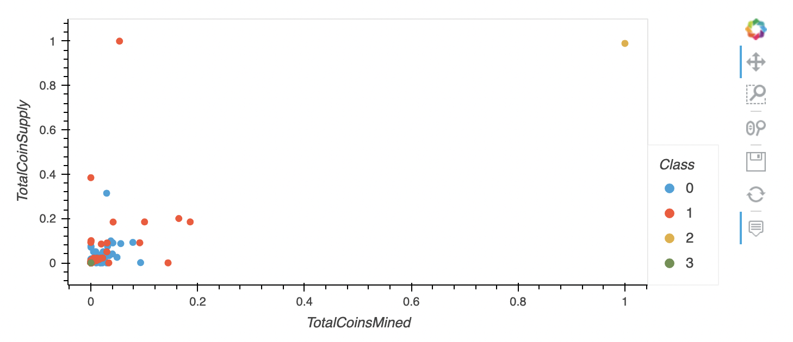

# Cryptocurrencies
Unsupervised Machine Learning, hvPlot, KMeans, PCA

## Overview
In this analysis we will use K-Means and Principal Component Analysis (PCA) to provide a cryptocurrency investment portfolio to customers at Accountability Accounting. The report will include trending cryptocurrencies, which will by grouped into clusters using K-Means, creating a classification system to determine whether or not certain currencies are best situated to receive an investment. 

The data used in this model will have no known output, therefore we will implement unsupervised machine learning to find grouping or trends in the data. In this analysis we will use unsupervised learning to determine which cryptocurrencies are trending. We will use PCA to speed up the unsupervised machine learning algorithm by reducing the amount of dimensions/features, transforming the large set of variables into a smaller one. This smaller set of variables will still contain most of the information from the original set. Then clustering will allow us to group data points together into clusters. The K-Means algorithm forms clusters of data using the means of all of the data points belonging to a cluster. Belonging to a cluster results from distance and/or similarity to a centroid (the mean of all the data points in a cluster). 

We decide how many clusters to form and a useful way to do this is by using the Elbow Curve plot to find centroids. Our x-axis will be the number of clusters (k values) and the y-axis will be a selected objective function, in this analysis it will be inertia which will measure variation within the dataset. The shape of the line represents an arm, and the point at which the we determine an elbow appears is where the line will become mostly horizontal, meaning less variance in the data. The elbow will determine the number of clusters. Once the data is fully processed, transformed and grouped into clusters we will visualize it using hvPlot. 

## Results
First we preprocess the data in Deliverable 1. This step makes sure the data is ready for the unsupervised learning model. Steps in this process include making sure there null values are handled, making sure all values are numerical, and scaling all values with the StandardScaler() method. Once the data is processed we can reduce the size of the dimensions into three principal components. This will make the analysis less complex and easier to visualize. We can then use the new dataframe with three principal compenent columns. After plotting the elbow curve we can see that there will be four clusters (k = 4) when we group the data. 

After our elbow curve is plotted, we can initiate a K-Means model with four clusters. The dataframe "pcs_df" is then fitted to the model and predictions to correspond each feature to a class. The values range from 0-3, each value labeling its respective cluster.  

After our 3D plot is visualized we can add a new "Class" column to a hvPlot table, shown in the image directly below. 

Finally we find the amount of tradable clusters available for our clients to confidently invest in. We generate a new dataframe with "TotalCoinsSupply", "TotalCoinsMined", "CoinName" and "Class". With this new dataframe we can visualize the the four classes in a 2D scatter plot, shown below. 

## Summary
After completing the analysis, we can confirm there are 532 tradable cryptocurrencies available for our clientele. In the final 2D scatter plot we cannot see 4 distinct clusters. Clusters from Class 0, Class 1, and the single value for Class 3 are overlapping in the bottom left corner of the visual.  Class 2 is made up of one cryptocurrency, BitTorrent, is isolated in the upper right corner of the visual. BitTorrent has the largest amount of coines mined and the largest supply, so they have plenty to sell and may be in line for a large sum of income. 
